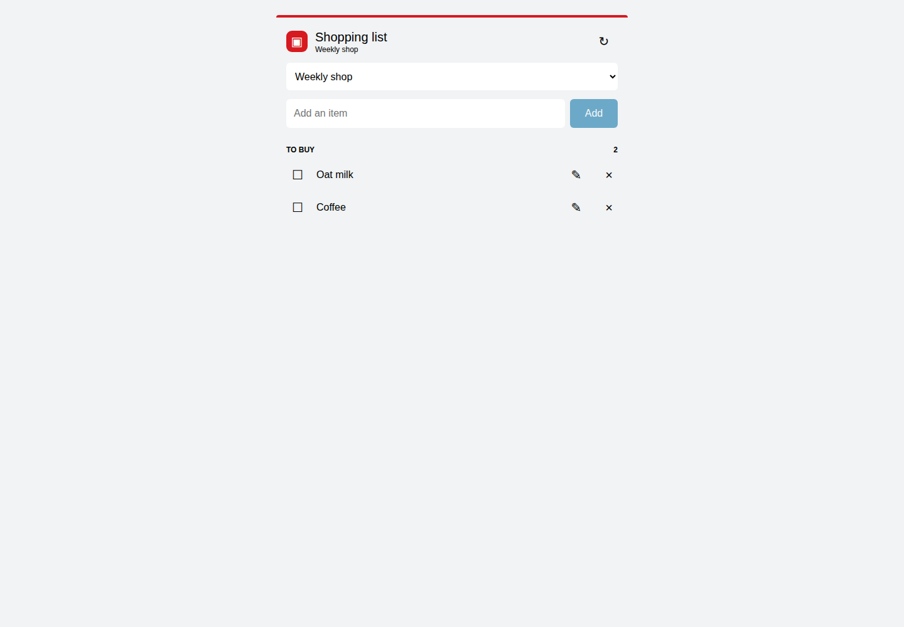

# ICA Shopping List Card

A [Home Assistant](https://www.home-assistant.io/) Dashboard card for `todo` entities.
It works as a standard to-do card for any entity and optionally adds ICA product
suggestions for entities provided by the separate
[`ha-ica-shopping-list`](https://github.com/whiteout12/ha-ica-shopping-list) integration.



## Install

Install this repository as a **Dashboard** item through HACS, add the resource if HACS
does not do so automatically, then add a manual card:

```yaml
type: custom:ica-shopping-list-card
entities:
  - todo.shopping_list
  - todo.ica_weekly_shop
default_entity: todo.ica_weekly_shop
title: Shopping list
```

`entities` is required and must contain unique `todo.*` entities. `default_entity` must
be one of them. Generic todo entities retain normal list and free-text add behavior.

## ICA suggestions and privacy

With integration `0.2.0` or later, entering three characters waits 300 ms before asking
for up to eight ICA suggestions. The three-character threshold is a card policy based on
measured behavior, not a claimed ICA server minimum. Choose a suggestion, then explicitly select **Add**.
Only an opaque, short-lived selection key travels from the card; product article data,
EANs, IDs, and raw article JSON never enter the browser. Editing or clearing the selected
text intentionally switches Add back to `todo.add_item` free-text behavior.

Selection keys expire after five minutes. Re-select after expiry. Authentication or an
uncertain selected add keeps your text and never retries or silently falls back to a
free-text add. Reauthenticate the integration in Home Assistant when requested.

## Compatibility

| Card   | Integration/entity                | Behavior                                        |
| ------ | --------------------------------- | ----------------------------------------------- |
| v1.0.x | ICA 0.2.0+ / contract v1          | Suggestions and article-preserving selected Add |
| v1.0.x | ICA 0.1.3 or unavailable provider | Standard list and free-text Add                 |
| v1.0.x | Generic `todo` entity             | Standard list and free-text Add                 |

This card and the ICA integration are independent repositories and releases. Report card
issues here; report provider/account issues to the integration repository.
